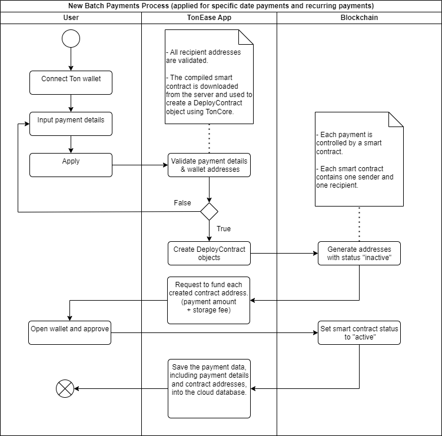
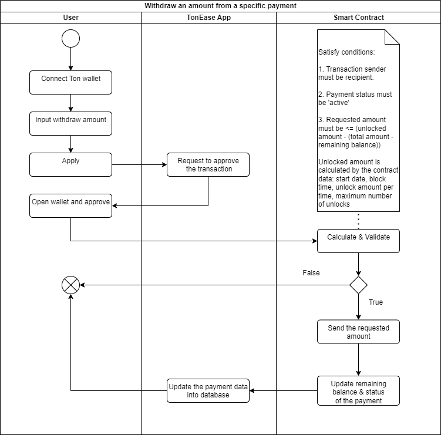
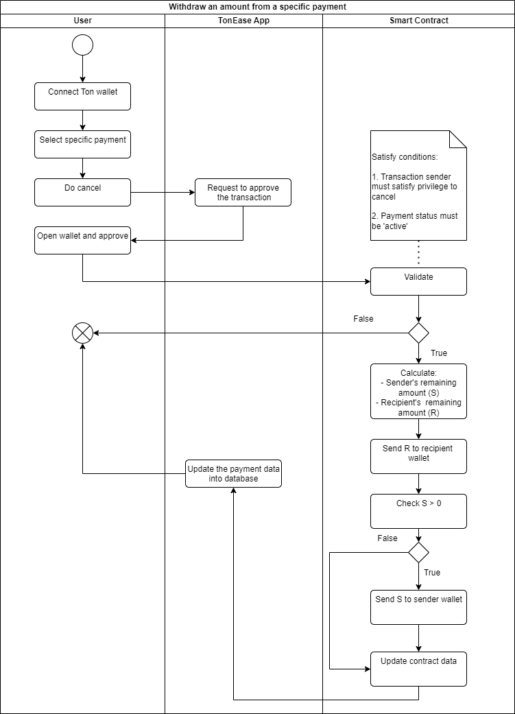
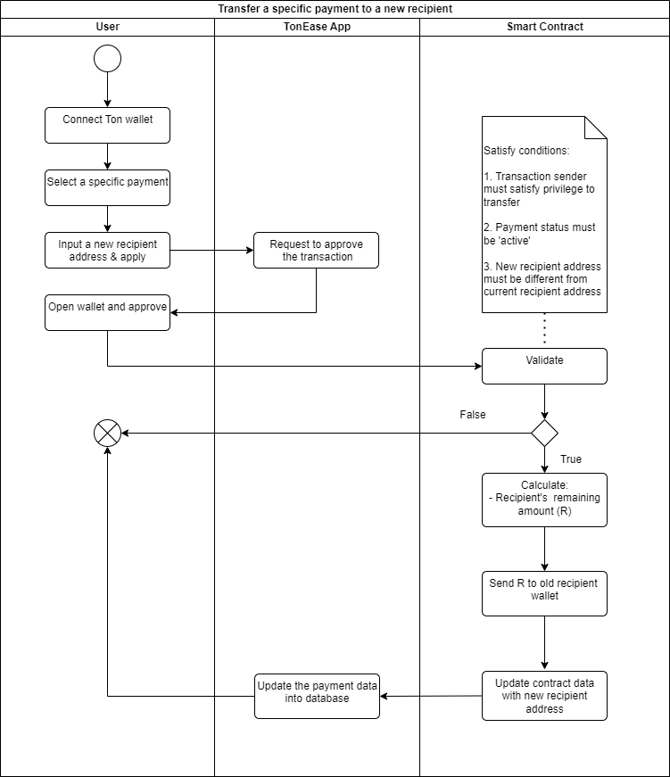

# **TONEASE** - Automate Salaries & Recurring Payments
## Description
TonEase allow users create batch payments with many options, such as instant payment, specific date payment, and recurring payment. User can use these features to pay wages, disburse tokens, and issue invoices.

TonEase works not only on web browsers but also in Telegram as a **TWA**.

Web URL: [TonEase](https://tonease.a2n.finance) (Mainnet)

Telegram Chatbot ID: **@tonease**

## Getting Started
These are instructions on how to install and run your dApp. Include prerequisites, installation steps, and commands needed to start the application.

### Prerequisites
- Have basic knowledge about Javascript & React App.
- NodeJS 16+
- One of wallets: TonKeeper, OpenMask, MyTonWallet, TonSafe. We're highly recommend TonKeeper, because it supports both iOS and Addroid, you can switch between main net and test net easily. 

### Installation Steps
- Copy .env.example to .env.local
- Change settings in .env.local
    - `NEXT_PUBLIC_DATABASE_URL`: your cloud database url.
    - `NEXT_PUBLIC_NET_ENV`: tesnet or mainnet.
- This app has used **TonConnect 2.0**, so you need to change the manifest file `public/tonconnect-manifest.json`.
- Install dependencies: `npm i`

### Commands to start 
- To compile the smart contract: `npm run build-ton`
- To run unit tests: `npm run test-tonease`, test details will be written to `log.txt`
- Run this app on Dev mode: `npm run dev`
- Run this app on Production mode: `npm run build` and `npm run start`
- To work with Wallet (TonKeeper), you must have a public URL. you can use `ngrok` or deploy this web app to a cloud server and map a new domain to the server IP. 

## Technologies Used
List the technologies and tools used to build this app, including programming languages, frameworks, and libraries.

### Programming languages
- Javascript
- FunC
- TypeScript
### Frameworks
- React 18
- NextJS 12.1
### Libraries
- Ton Core
- Ton Crypto
- FunC JS: to compile smart contracts to file `.cell`.
- Sandbox & Test Utils: for testing purpose.
- Ton Access: to provide access to API endpoints of TON testnet or mainnet.
- Ton Connect: to integrate with TON wallets.
- TWA Dev SDK: to support this dApp working as a TWA.
- Charka UI Components: to develop UI/UX.

## Smart Contracts
Our main smart contract is TonEease. It borrows ideas of the **TON Payment Channel** and **TON Subscription**, but it is very different in implementation.

### Creat Batch Payments Proccess

This workflow demonstrates how smart contracts are deployed to facilitate both one-time payments on a scheduled date and recurring payments.

Storage fee for each contract is calculated by this formula:

` storage_fee = (cells_count * cell_price + bits_count * bit_price)
  / 2^16 * time_delta`

You can check `storageFeeCalculator` in this file `src/core/ton/index.ts`

### Withdraw Token Process

### Cancel Payment Proccess

### Transfer Payment Proccess

## Usage
To use this app on any web browser, use this url: [https://tonease.a2n.finance](https://tonease.a2n.finance)

To use this app in Telegram as a TWA, 
- Open Telegram app on your mobile device.
- Search this bot id `@tonease`
- Click on the bottom left menu button: **TonEase - A2N Finance**

To create instant batch payments for immediate or specific date transactions, click on the menu `Payments => One-Time Payments`

To pay wages or disburse tokens as an investor, click on the menu `Payments => Recurring Payments`

To issue an invoice, click on the menu `Invoice => New Invoice`

## Contributing
While this application is functional, there are areas that can still be improved, such as UI/UX, security, and smart contract functionality, as well as adding new features. We welcome any ideas or suggestions to help us make this app better. Please do not hesitate to contact us via email at john@a2n.finance.

## Acknowledgments
We would like to express our gratitude to the Ton-Community and Ton-Blockchain open-source projects, as well as the Ton-Dev chat channel on Telegram. Without the high-quality libraries and support from the TON community, we could not have completed this application.

## Contact

If you have any questions, please do not hesitate to contact us via email at john@a2n.finance.

## License
This package is released under the BSL 1.1 License.